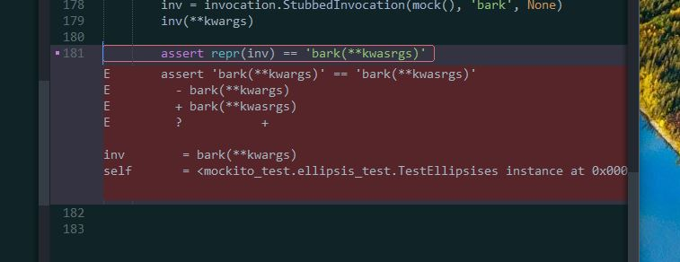

# py.test plugin for the sublime text editor

The plugin basically runs your tests, and annotates your files using the tracebacks.

# Common workflow

The defaults: it will run your tests on save; it will not show the output panel but annotate your views on failures instead. Like so:

Which test it will run depends on the red/green status of the previous run, and if you're currently editing a test file or an implementation file. It should work really okay. Set `"mode": "manual"` and just use your own key bindings if you think that's stupid. See [`Default.sublime-commands`](https://github.com/kaste/PyTest/blob/master/Default.sublime-commands) for some examples.

# Config

At least **look** at the [global settings](https://github.com/kaste/PyTest/blob/master/PyTest.sublime-settings). You usually have to edit the `pytest` setting to point at your py.test from your current virtualenv (the default is to run your global py.test which is usually *not* what you want). E.g.

    "pytest": "~/venvs/{project_base_name}/bin/py.test"
    OR:
    "pytest": ".env\\Scripts\\py.test"
    OR even:
    "pytest": "venv/path/to/python -m pytest"

The plugin will expand ${project_path}, ${project_base_name}, ${file}, etc. as usual. It will respect your `project-settings` like:

    {
      "folders":
      [
        {
          "path": "."
        }
      ],
      "settings": {
        "PyTest": {
          "mode": "auto",
          "options": "--tb=short -l -ff",
        },
      }
    }

You __really__ should add

    {
        "class": "status_bar",
        "settings": ["pytest_is_red"],
        "layer0.tint": [155, 7, 8], // -RED
    },

to your `.sublime-theme` to flash the status bar early if there are failures.

Likewise add

    {
        "class": "status_bar",
        "settings": ["pytest_is_green"],
        "layer0.tint": [8, 131, 8], // -GREEN
    },
    {
        "class": "label_control",
        "settings": ["pytest_is_green"],
        "parents": [{"class": "status_bar"}],
        "color": [19, 21, 32],
    },

to get a status bar notification if we're green. Add these styles *at the end* of your theme file.

You probably should also have a keybinding to show/hide the output panel quickly.

    { "keys": ["ctrl+'"], "command": "pytest_toggle_panel" },

Maybe a keybinding to run only the test under the cursor(s) as well:

    { "keys": ["ctrl+shift+'"], "command": "pytest_run_test_under_cursor"},

But that command is also available via the context menu.

# Install

As long as it's not listed, you must manually download/clone from github and put it in your Packages directory.

# TODO

- Parametrized tests are hard. We should somehow get the id of the test item and show it. Also: for parametrized tests the same test can fail multiple times; currently we just show multiple phantoms, which doesn't look good.
- XPASSED's are hard too. When a test xpasses we don't have a traceback, so we don't have proper phantoms as well. Currently we only flash the status bar red.
- For errors in the fixtures, we flash red, but do not yet annotate the test. You can still jump to the traceback via F4 etc. but it's not ideal and how it should be.
